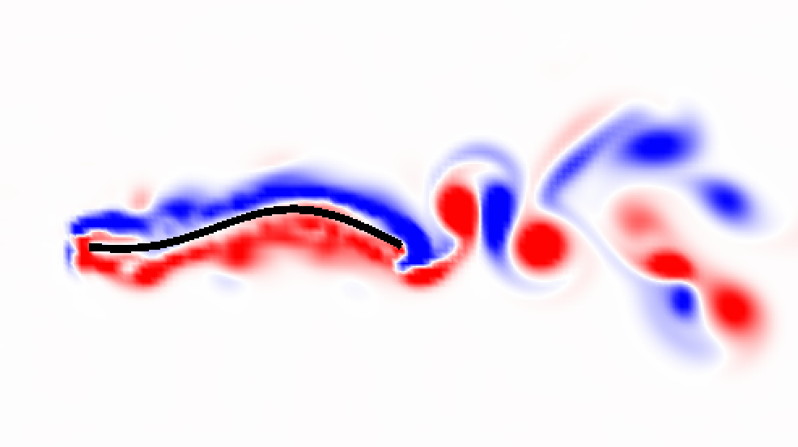

# computational-biofluids

The code in this repository is recovered code related to the work done under the [EMSW21 Research Training Grant for Mathematical and Computational Biofluids](https://www.nsf.gov/awardsearch/showAward?AWD_ID=1043626) at Tulane University in 2016. 

The code was developed jointly by Team Flexi; Monica Kala, Griffin Sandler, Alexander Hoover and Hakeem Frank. While missing the fluid simulation, it contains much of the code for simulating a heaving panel composed of springs and beams actuated at its edge.

### Report

- [Optimizing the Propulsive Performance of Heaving Panels with Nonuniform Elastic Profiles](https://bit.ly/2XHa9FW)